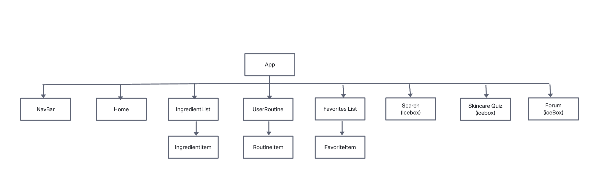
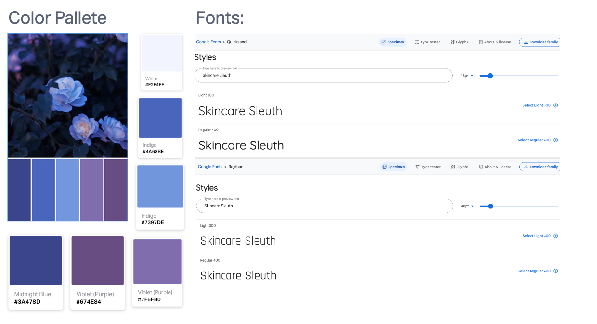
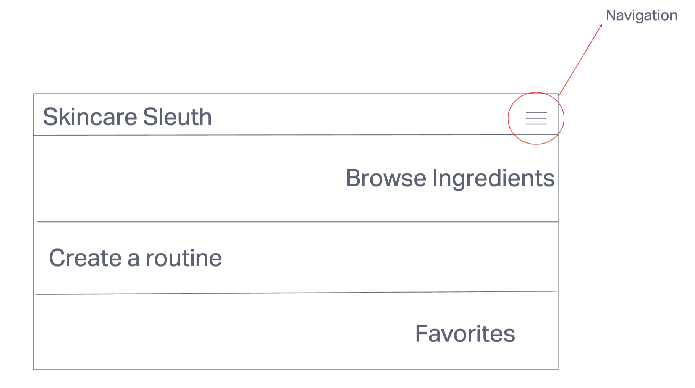
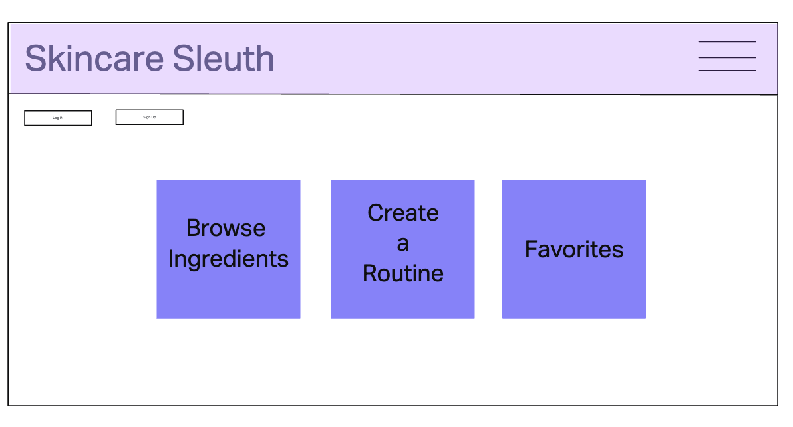
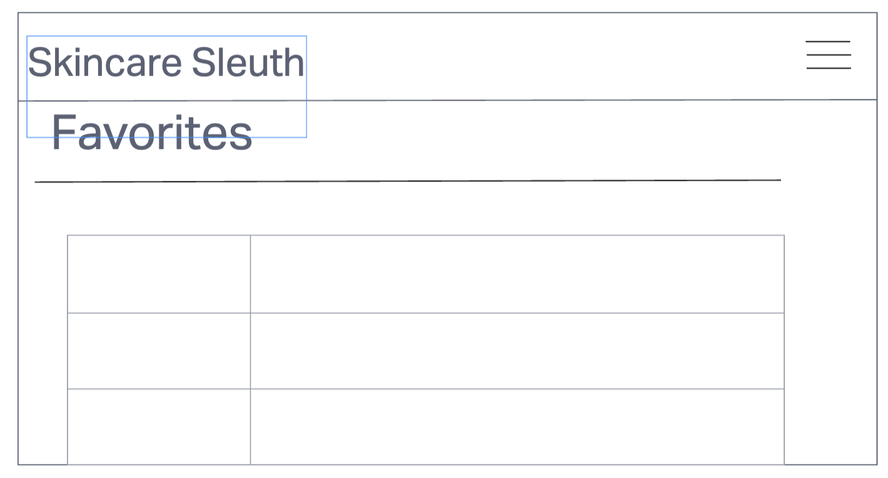
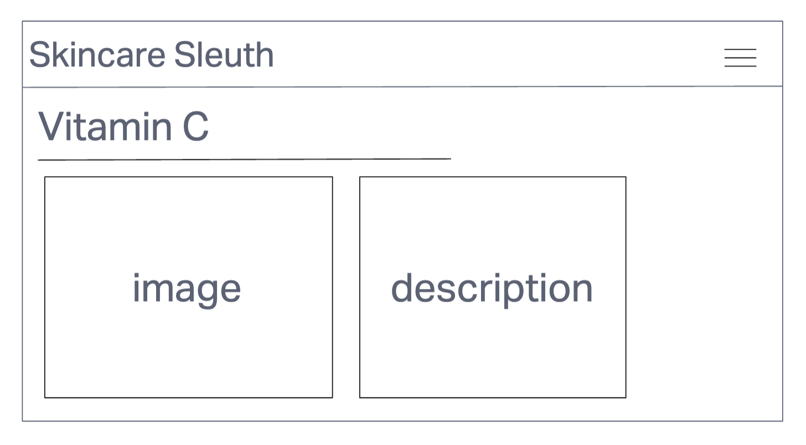
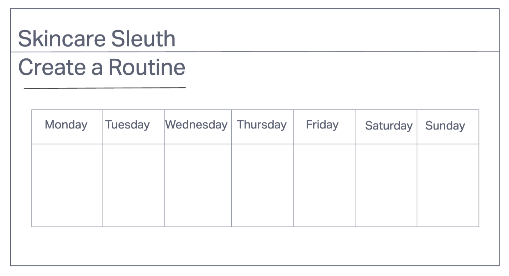

# Skincare Slueth

### Table of Contents

* [About the Project](#about-the-project)
* [Getting Started](#getting-started)
* [MVP Goals](#mvp-goals)
* [Wireframe](#wireframe)
* [Technolgies Used](#technologies-used)
* [Coding Challenges](#coding-challenges)
* [Next Steps](#next-steps)
* [Contributions](#contributions)

---
## About the Project

“Skincare Sleuth” is a react application made for skincare junkies who love to read up on skincare ingredients so they can make better informed decisions on their purchases. This application will allow users to curate a personalized skincare routine by adding products to their routine, search up the ingredients of their favorite products and also save them to a list for later reference.

Skincare is a journey for many which requires a lot of trial and error, there are a number of ingredients which can do wonders for our skin or the complete opposite, it's easy to get overwhelmed with choosing the right products for your skintype let alone creating a skincare routine for yourself. This application's purpose is for you to feel empowered about the purchases you make amidst all of the misinformation on the internet. Hence the name "Skincare Slueth", where "sleuth" means to investigate and discover, just like you on your skincare adventure!!!

### Example Site Pictures:

## Getting Started

To checkout my application, simly visit the [deployed website.](https://immense-river-09934.herokuapp.com/books)

You can also view the project's planning board on [Trello.](https://trello.com/b/8Eex7f8a/p3-skincare)

## MVP User Stories  

 

- As a user, I want to browse different skincare ingredients so I can read what each one is suggested for.
- As a user I want to add my skincare products to my own routine that works for my skincare concerns and lifestyle.
- As a user i want to add skincare products to my favorites so I can try them out after I use up the products I currently have.

## IceBox Items

 

- As a user I want to be able to search up my skincare concerns and look at suggested ingredients to improve my skin texture.
- As a user, I want to be able to take a skincare quiz so I can put in my age, lifestyle, concerns so a skincare routine is suggested for me.
- As a user I want to be able to post my skincare questions for other users to talk about their favorite products/routines

## Choosing an API

 

- I went with Open Beauty Facts API, this is a huge list encompassing not only popular skincare products but food items as well, this was the easiest to access (meaning free) and the one that closely aligned with the goals of my project. Unfortunately, it has not been updated in over 2 years and there are some discrepencies with the information.
- I was considering EWG Skin Deep API, the issue with this one is that it is heavily biased against skincare that doesn't have "natural" ingredients meaning it demonizes skincare ingredients which get a bad rep but are commonly used to stablize ingredients for example.
-I applied for Sephora API but I got denied because I don't have valid credentials as I up a mere bootcamp student at this time....

## Wireframe and Planning:

This was my ideal color palette and font choices, I really like light purple as a base for this application. I also aimed to find simple easy to read fonts for this project

## Technologies Used

* Node.js
* Express
* MongoDB
* EJS
* Heroku
* HTML
* CSS

## Acknowlegements
* Instructional Team at Adobe Digital Academy
* Stack Overflow.
* https://www.w3schools.com/

## Resources

- I created my searchbox with the help of these articles [Link 1](https://medium.com/@rushipandya3315/how-to-create-dynamic-width-search-box-using-flexbox-b6b91b9f2860) and [Link 2](https://www.w3schools.com/howto/howto_css_search_button.asp)

# Getting Started with Create React App

This project was bootstrapped with [Create React App](https://github.com/facebook/create-react-app).

## Available Scripts

In the project directory, you can run:

### `npm start`

Runs the app in the development mode.\
Open [http://localhost:3000](http://localhost:3000) to view it in your browser.

The page will reload when you make changes.\
You may also see any lint errors in the console.

### `npm test`

Launches the test runner in the interactive watch mode.\
See the section about [running tests](https://facebook.github.io/create-react-app/docs/running-tests) for more information.

### `npm run build`

Builds the app for production to the `build` folder.\
It correctly bundles React in production mode and optimizes the build for the best performance.

The build is minified and the filenames include the hashes.\
Your app is ready to be deployed!

See the section about [deployment](https://facebook.github.io/create-react-app/docs/deployment) for more information.

### `npm run eject`

**Note: this is a one-way operation. Once you `eject`, you can't go back!**

If you aren't satisfied with the build tool and configuration choices, you can `eject` at any time. This command will remove the single build dependency from your project.

Instead, it will copy all the configuration files and the transitive dependencies (webpack, Babel, ESLint, etc) right into your project so you have full control over them. All of the commands except `eject` will still work, but they will point to the copied scripts so you can tweak them. At this point you're on your own.

You don't have to ever use `eject`. The curated feature set is suitable for small and middle deployments, and you shouldn't feel obligated to use this feature. However we understand that this tool wouldn't be useful if you couldn't customize it when you are ready for it.

## Learn More

You can learn more in the [Create React App documentation](https://facebook.github.io/create-react-app/docs/getting-started).

To learn React, check out the [React documentation](https://reactjs.org/).

### Code Splitting

This section has moved here: [https://facebook.github.io/create-react-app/docs/code-splitting](https://facebook.github.io/create-react-app/docs/code-splitting)

### Analyzing the Bundle Size

This section has moved here: [https://facebook.github.io/create-react-app/docs/analyzing-the-bundle-size](https://facebook.github.io/create-react-app/docs/analyzing-the-bundle-size)

### Making a Progressive Web App

This section has moved here: [https://facebook.github.io/create-react-app/docs/making-a-progressive-web-app](https://facebook.github.io/create-react-app/docs/making-a-progressive-web-app)

### Advanced Configuration

This section has moved here: [https://facebook.github.io/create-react-app/docs/advanced-configuration](https://facebook.github.io/create-react-app/docs/advanced-configuration)

### Deployment

This section has moved here: [https://facebook.github.io/create-react-app/docs/deployment](https://facebook.github.io/create-react-app/docs/deployment)

### `npm run build` fails to minify

This section has moved here: [https://facebook.github.io/create-react-app/docs/troubleshooting#npm-run-build-fails-to-minify](https://facebook.github.io/create-react-app/docs/troubleshooting#npm-run-build-fails-to-minify)
